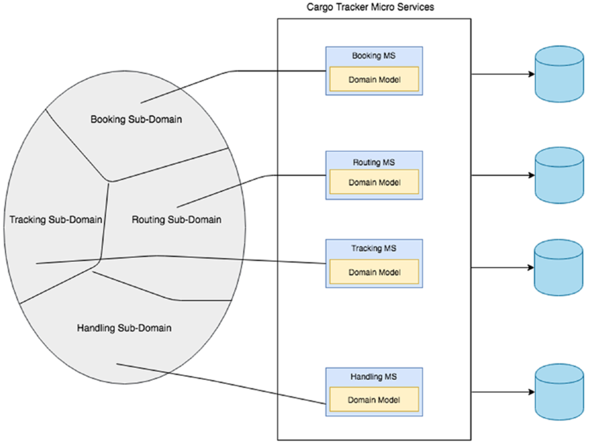
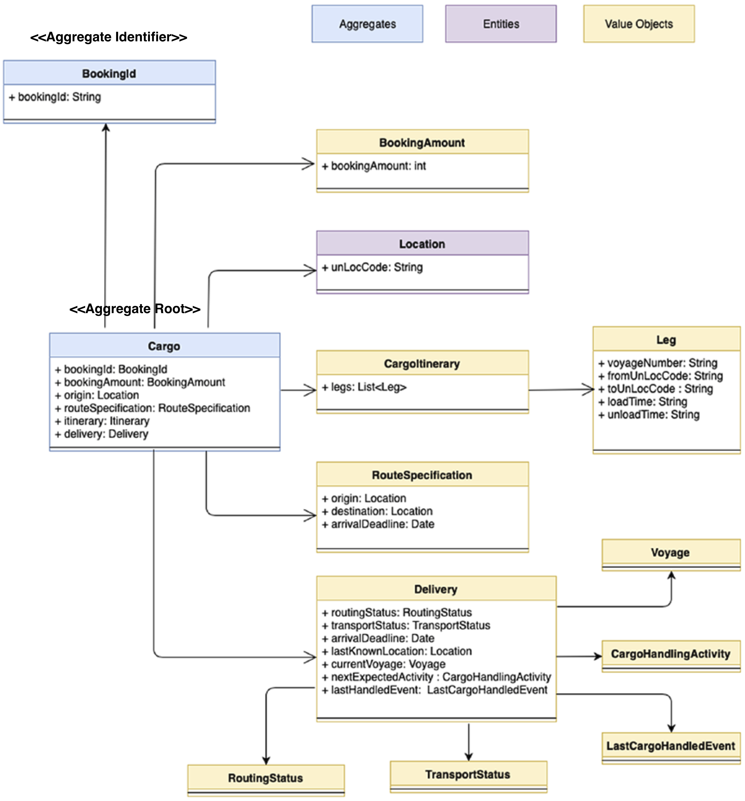
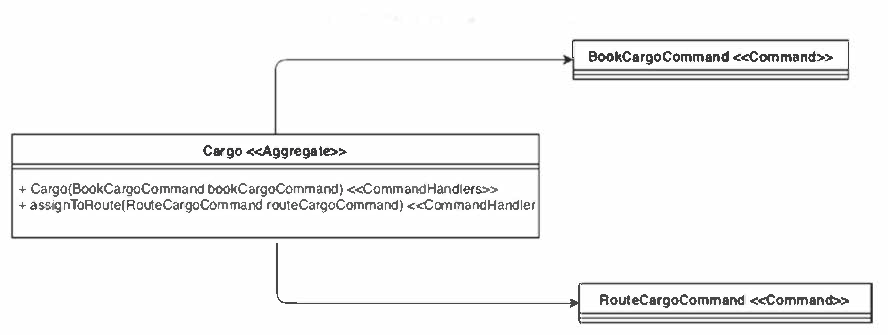

# Cargo Tracker 0.1

This Spring Boot project<sup id="a1">[[1]](#f1)</sup> is used to illustrate the patterns of Domain-Driven Design and the Event-Driven Architecture. 


**The Bounded Contexts of Cargo Tracker**



**The Booking Bounded Context - Domain Model**



**Command classes in Booking**

Commands are similar to domain events, but they explicitly model
what update is made to the system.
They play an important role in the CQRS architecture.



___CONSIDER:___
_The [Delivery.java](./bookingms/src/main/java/csci318/demo/cargotracker/bookingms/domain/model/valueobjects/Delivery.java)
class (value object) includes some business logic. Consider how to separate the logic in a separate
Domain Service class_

## Apache Kafka Setup
This Spring Boot project uses Apache Kafka as a messaging platform.
To run this project, you need to set up Kafka first.

#### Linux and MacOS
Download a **binary package** of Apache Kafka (e.g., `kafka_2.13-2.8.0.tgz`) from
[https://kafka.apache.org/downloads](https://kafka.apache.org/downloads)
and upzip it.
In the Terminal, `cd` to the unzip folder, and start Kakfa with the following commands (each in a separate Terminal session):
```bash
./bin/zookeeper-server-start.sh ./config/zookeeper.properties
```
```bash
./bin/kafka-server-start.sh ./config/server.properties
```

#### Windows
Download a **binary package** of Apache Kafka (e.g., `kafka_2.13-2.8.0.tgz`) from
[https://kafka.apache.org/downloads](https://kafka.apache.org/downloads)
and unzip it to a directory, e.g., `C:\kafka`&mdash;Windows does not like a complex path name (!).

<!--
In the configuration file `C:\kafka\config\zookeeper.properties`, comment out the line `"dataDir=/tmp/zookeeper"`. In `C:\kafka\config\server.properties`, change the line `"log.dirs=/tmp/kafka-logs"` to `"log.dirs=.kafka-logs"`.
-->

Use the following two commands in the Windows CMD (one in each window) to start Kafka:
```bash
C:\kafka\bin\windows\zookeeper-server-start.bat C:\kafka\config\zookeeper.properties
```
```bash
C:\kafka\bin\windows\kafka-server-start.bat C:\kafka\config\server.properties
```

### Run the Application ##
Book and check cargoes with the following command:
(Linux/MacOS)
```shell
curl -X POST -H "Content-Type:application/json" -d '{"bookingAmount":20,"originLocation":"HK","destLocation":"NY","destArrivalDeadline":"2010-08-01"}' http://localhost:8787/cargobooking
```
```shell
curl -X GET -H "Content-Type:application/json" http://localhost:8787/cargobooking/findAllBookingIds
```
(windows)
```shell
curl -X POST -H "Content-Type:application/json" -d "{\"bookingAmount\":20,\"originLocation\":\"HK\",\"destLocation\":\"NY\",\"destArrivalDeadline\":\"2010-08-01\"}" http://localhost:8787/cargobooking
```
```shell
curl -X GET -H "Content-Type:application/json" http://localhost:8787/cargobooking/findAllBookingIds
```

### View Kafka Topics
After running the `bookingms`'s main class, check the Kafka topics with the following command:

(Linux/MacOS)
```shell
./bin/kafka-topics.sh --bootstrap-server=localhost:9092 --list
```
(Windows)
```shell
C:\kafka\bin\windows\kafka-topics.bat --bootstrap-server=localhost:9092 --list
```
You should see two topic names `cargobookings` and `cargoroutings`. You can consume data in the `cargobookings` topic:

(Linux/MacOS)
```shell
./bin/kafka-console-consumer.sh --bootstrap-server localhost:9092 --topic cargobookings --from-beginning
```
(Windows)
```shell
c:\kafka\bin\windows\kafka-console-consumer.bat --bootstrap-server localhost:9092 --topic cargobookings --from-beginning
```

### Trouble Shooting
If you cannot start Kafka, try to clean up data in the Kafka topics to start over.
For this purpose, in Linux/MacOS, delete the folders `/tmp/zookeeper`, `/tmp/kafka-logs`
and `/tmp/kafka-streams` (if any). In Windows, delete the folders `C:\tmp\zookeeper`,
`C:\tmp\kafka-logs` and `C:\kafka\kafka-streams` (if any).


## Event-Driven Architecture

<!-- ### Origin of `CargoBookedEvent` and `CargoRoutedEvent`-->
### Events and Kafka Topics

Two Kafka topics, `"cargobookings"` and `"cargoroutings"` are created by this application (i.e., by the **Booking Microservice**).
Events [`CargoBookedEvent`](./bookingms/src/main/java/csci318/demo/cargotracker/shareddomain/events/CargoBookedEvent.java) and 
[`CargoRoutedEvent`](./bookingms/src/main/java/csci318/demo/cargotracker/shareddomain/events/CargoRoutedEvent.java) are published to these
two topics, respectively. The source code of the two events is in the `sharedmain.events` package.

The two events are orignally created  by the domain class 
[`Cargo`](./bookingms/src/main/java/csci318/demo/cargotracker/bookingms/domain/model/aggregates/Cargo.java), by using the `AbstractAggregateRoot` generic class
(see [REST Services with Spring V4](https://github.com/gxshub/rest-services-with-spring-v4)).
The two events are listened to by the
[`CargoEventPublisherService`](./bookingms/src/main/java/csci318/demo/cargotracker/bookingms/application/internal/outboundservices/CargoEventPublisherService.java), 
which publish the same events, but as external events, to the two Kafka topics.
Only the `"cargoroutings"` tpoic is consumed by the **Tracking Microservice**. The consumption of `CargoRoutedEvent` events is not implemented currently (see TODO<sup id="a2">[2](#f2)</sup>).

### Kafka Publisher API in Booking Microservice

The following _three_ parts in the source code of **Booking Microservice** relate to publishing events to Kafka topics.

(1) A Kafka binder and two binding topics are defined in the file [`application.properties`](./bookingms/src/main/resources/application.properties)
of Booking Microservice:
```properties
spring.cloud.stream.kafka.binder.brokers=localhost:9092
spring.cloud.stream.bindings.cargoBookingChannel.destination=cargobookings
spring.cloud.stream.bindings.cargoRoutingChannel.destination=cargoroutings
```
The port `localhost:9092` runs the Kafka server. The two Kafka topics `"cargobookings"` and `"cargoroutings"`
are bound to two **binding channels** named `"gargoBookingChannel"` and `"cargoBoutingChannel"`.

(2) The two (output) binding message channels are used in the interface [`CargoEventSource`](./bookingms/src/main/java/csci318/demo/cargotracker/bookingms/infrastructure/brokers/CargoEventSource.java)
of Booking Microservice:
```java
public interface CargoEventSource {
    
    @Output("cargoBookingChannel")
    MessageChannel cargoBooking();

    @Output("cargoRoutingChannel")
    MessageChannel cargoRouting();
}
```

(3) The [`CargoEventPublisherService`](./bookingms/src/main/java/csci318/demo/cargotracker/bookingms/application/internal/outboundservices/CargoEventPublisherService.java) uses the two messages channels to publish events. 
The `MessageBuilder` API is used to create messages that wrap the events.
```java
@Service
@EnableBinding(CargoEventSource.class)
public class CargoEventPublisherService {

    CargoEventSource cargoEventSource;

    public CargoEventPublisherService(CargoEventSource cargoEventSource){
        this.cargoEventSource = cargoEventSource;
    }

    @TransactionalEventListener
    public void handleCargoBookedEvent(CargoBookedEvent cargoBookedEvent){
        cargoEventSource.cargoBooking().send(MessageBuilder.withPayload(cargoBookedEvent).build());
    }

    @TransactionalEventListener
    public void handleCargoRoutedEvent(CargoRoutedEvent cargoRoutedEvent){
        cargoEventSource.cargoRouting().send(MessageBuilder.withPayload(cargoRoutedEvent).build());
    }
}
```

### Kafka Consumer API in Tracking Microservice

Similarly, the following _three_ parts in the source code of **Tracking Microservice** relate to consuming events from Kafka topics.

(1) The Kafka binders are defined in the file [`application.properties`](./trackingms/src/main/resources/application.properties)
of Tracking Microservice:
```properties
spring.cloud.stream.kafka.binder.brokers=localhost:9092
spring.cloud.stream.bindings.cargoBookingChannel.destination=cargobookings
spring.cloud.stream.bindings.cargoRoutingChannel.destination=cargoroutings
```
The two topic names must be the same as those in the Booking Microservice, 
but the two binding channel names are internal to the Tracking Microservice.
(Note. Only the topic `"cargobookings"` is used in the Tracking Microservice. The other one is shown
here only for illustration.)

(2) Two input binding channels are declared in the interface [`CargoEventSource`](./trackingms/src/main/java/csci318/demo/cargotracker/trackingms/infrastructure/brokers/CargoEventSource.java)
of Tracking Microservice:
```java
public interface CargoEventSource {

    String BOOKING_INPUT = "cargoBookingChannel";
    String ROUTING_INPUT = "cargoRoutingChannel";

    @Input(BOOKING_INPUT)
    SubscribableChannel bookingChannel();

    @Input(ROUTING_INPUT)
    SubscribableChannel routingChannel();

}
```
(Note. Only the `"cargoBookingChannel"` channel is used here. The other one is shown
here only for illustration.)

(3) The [`CargoRoutedEventHandler`](./trackingms/src/main/java/csci318/demo/cargotracker/trackingms/interfaces/events/CargoRoutedEventHandler.java)
only consumes the `CargoBookedEvent` events from the `"cargoBookingChannel"` channel:
```java
@Service
@EnableBinding(CargoEventSource.class)
public class CargoRoutedEventHandler {
    
    @StreamListener(CargoEventSource.BOOKING_INPUT)
    public void receiveEvent(CargoBookedEvent cargoBookedEvent) {
        System.out.println("****READING FROM KAFKA TOPIC cargobookings: "+
                cargoBookedEvent.getCargoBookedEventData().getBookingId()+"****");
    }
}
```
---
<a id="f2">***TODO:***</a> Implement a consumer in the **Routing Microservice** which consumes  events from the `"cargoroutings"` topic.
[↩](#a2)

***TODO:*** Consider how to enrich the events, e.g., including "booking amount" information (as an attribute) in the `CargoRoutedEvent` class?

---
<a id="f1">[1]</a> Note. The project is based on the source code for
[Chapter 5](https://github.com/practicalddd/practicaldddbook/tree/master/Chapter5) of the book _Practical Domain-Driven Design in Enterprise Java_ with modification. The images are taken also from the book. [↩](#a1)
