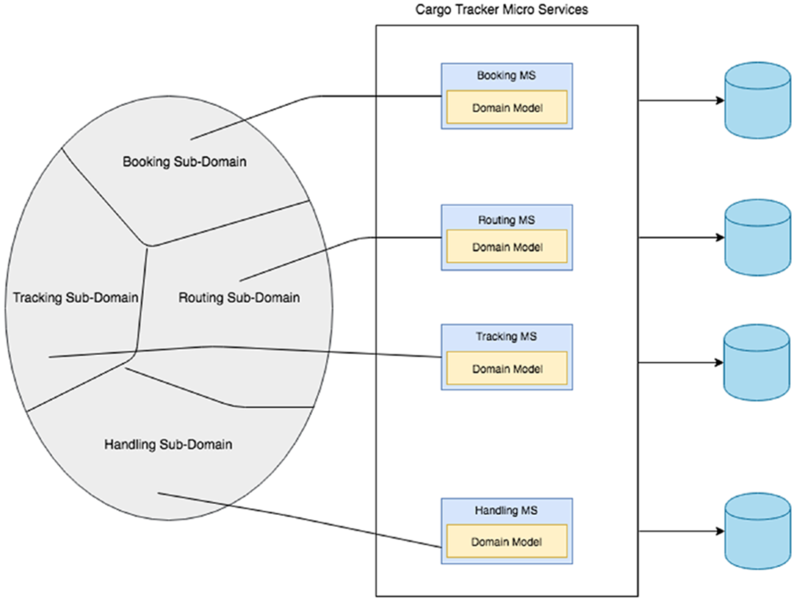
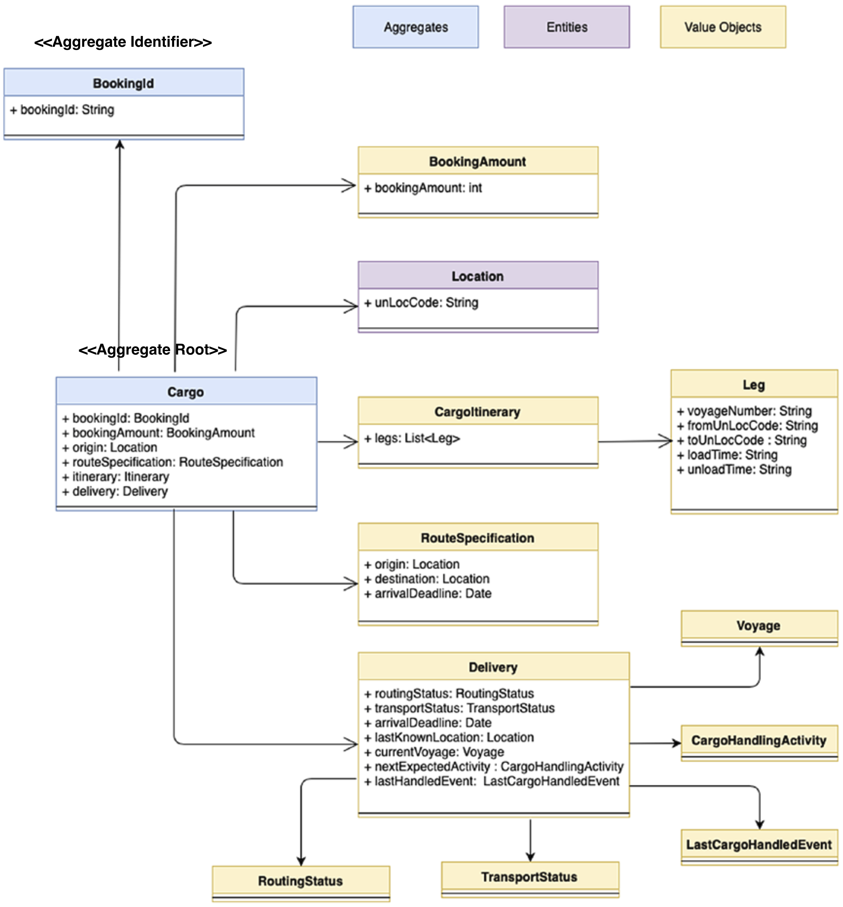
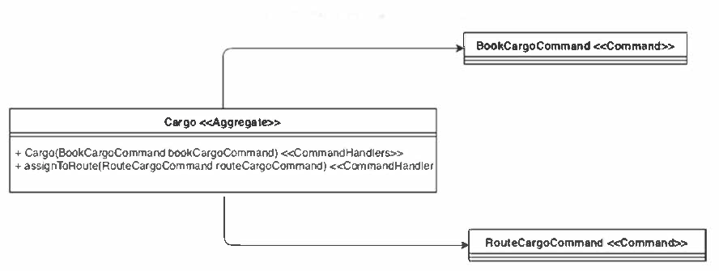

# Cargo Tracker <sup id="a1"> <!--[[1]](#f1)</sup>-->

This Spring Boot project demonstration the patterns of Domain-Driven Design and 
the Event-Driven Architecture based on Apache Kafka.

This sample project is taken from the
[Chapter 5](https://github.com/practicalddd/practicaldddbook/tree/master/Chapter5) example in the book _Practical Domain-Driven Design in Enterprise Java_. 
But unlike the original example, we use Apache Kafka of event streaming.
The following images are taken also from the book.

<!-- ## Domain-Driven Design Patterns-->
### Four Microservices in Cargo Tracker
- **Booking MS** 
- **Routing MS** 
- **Tracking MS** 
- **Handling MS** 
  


#### Booking Bounded Context - Domain Model


__Command classes in Booking__

Commands are similar to domain events, but they explicitly model
what update is made to the system.
They play an important role in the CQRS architecture.



## Apache Kafka Setup
This Spring Boot project uses Apache Kafka as a messaging platform.
To run this project, you need to set up Kafka first.

#### Linux and MacOS
Download a **binary package** of Apache Kafka (e.g., `kafka_2.13-3.7.0.tgz`) from 
[https://kafka.apache.org/downloads](https://kafka.apache.org/downloads)
and unzip it.
In the Terminal, `cd` to the unzip folder, and start Kafka with the following commands (each in a separate Terminal session):
```bash
./bin/zookeeper-server-start.sh ./config/zookeeper.properties
```
```bash
./bin/kafka-server-start.sh ./config/server.properties
```

#### Windows
Download a **binary package** of Apache Kafka (e.g., `kafka_2.13-3.7.0.tgz`) from 
[https://kafka.apache.org/downloads](https://kafka.apache.org/downloads) 
and unzip it to a directory, e.g., `C:\kafka`&mdash;Windows does not like a complex path name (!).

<!--
In the configuration file `C:\kafka\config\zookeeper.properties`, comment out the line `"dataDir=/tmp/zookeeper"`. In `C:\kafka\config\server.properties`, change the line `"log.dirs=/tmp/kafka-logs"` to `"log.dirs=.kafka-logs"`.
-->

Use the following two commands in the Windows CMD (one in each window) to start Kafka:
```bash
C:\kafka\bin\windows\zookeeper-server-start.bat C:\kafka\config\zookeeper.properties
```
```bash
C:\kafka\bin\windows\kafka-server-start.bat C:\kafka\config\server.properties
```

## Run The Application

Book a cargo:
```shell
curl -X POST -H "Content-Type:application/json" -d "{\"bookingAmount\":100,\"originLocation\":\"CNHKG\",\"destLocation\":\"USNYC\",\"destArrivalDeadline\":\"2019-09-28\"}" http://localhost:8787/cargobooking
```
Check all booked cargoes:
```shell
curl -X GET -H "Content-Type:application/json" http://localhost:8787/cargobooking/findAllBookingIds
```
Assign a route (replace `<<bookingId>>` with the returned book key):
```shell
bookingId="<<bookingId>>"
```
```shell
curl -X POST -H "Content-Type:application/json" -d "{\"bookingId\":\"$bookingId\"}" http://localhost:8787/cargorouting
```
Received at port:
```shell
curl -X POST -H "Content-Type:application/json" -d "{\"bookingId\":\"$bookingId\",\"unLocode\":\"CNHKG\",\"handlingType\":\"RECEIVE\",\"completionTime\":\"2019-08-23\",\"voyageNumber\":\"\"}" http://localhost:8786/cargohandling
```
Loaded onto carrier:
```shell
curl -X POST -H "Content-Type:application/json" -d "{\"bookingId\":\"$bookingId\",\"unLocode\":\"CNHKG\",\"handlingType\":\"LOAD\",\"completionTime\":\"2019-08-25\",\"voyageNumber\":\"0100S\"}" http://localhost:8786/cargohandling
```
Unloaded:
```shell
curl -X POST -H "Content-Type:application/json" -d "{\"bookingId\":\"$bookingId\",\"unLocode\":\"CNHGH\",\"handlingType\":\"UNLOAD\",\"completionTime\":\"2019-08-28\",\"voyageNumber\":\"0100S\"}" http://localhost:8786/cargohandling
```
Loaded onto next carrier:
```shell
curl -X POST -H "Content-Type:application/json" -d "{\"bookingId\":\"$bookingId\",\"unLocode\":\"CNHGH\",\"handlingType\":\"LOAD\",\"completionTime\":\"2019-09-01\",\"voyageNumber\":\"0101S\"}" http://localhost:8786/cargohandling
```
Unloaded:
```shell
curl -X POST -H "Content-Type:application/json" -d "{\"bookingId\":\"$bookingId\",\"unLocode\":\"JNTKO\",\"handlingType\":\"UNLOAD\",\"completionTime\":\"2019-09-10\",\"voyageNumber\":\"0101S\"}" http://localhost:8786/cargohandling
```
Loaded onto next carrier:
```shell
curl -X POST -H "Content-Type:application/json" -d "{\"bookingId\":\"$bookingId\",\"unLocode\":\"JNTKO\",\"handlingType\":\"LOAD\",\"completionTime\":\"2019-09-15\",\"voyageNumber\":\"0102S\"}" http://localhost:8786/cargohandling
```
Unloaded:
```shell
curl -X POST -H "Content-Type:application/json" -d "{\"bookingId\":\"$bookingId\",\"unLocode\":\"USNYC\",\"handlingType\":\"UNLOAD\",\"completionTime\":\"2019-09-25\",\"voyageNumber\":\"0102S\"}" http://localhost:8786/cargohandling
```
Customs:
```shell
curl -X POST -H "Content-Type:application/json" -d "{\"bookingId\":\"$bookingId\",\"unLocode\":\"USNYC\",\"handlingType\":\"CUSTOMS\",\"completionTime\":\"2019-09-26\",\"voyageNumber\":\"\"}" http://localhost:8786/cargohandling
```
Claimed:
```shell
curl -X POST -H "Content-Type:application/json" -d "{\"bookingId\":\"$bookingId\",\"unLocode\":\"USNYC\",\"handlingType\":\"CLAIM\",\"completionTime\":\"2019-09-28\",\"voyageNumber\":\"\"}" http://localhost:8786/cargohandling
```
<!--
(windows)
```shell
curl -X POST -H "Content-Type:application/json" -d "{\"bookingAmount\":20,\"originLocation\":\"HK\",\"destLocation\":\"NY\",\"destArrivalDeadline\":\"2010-08-01\"}" http://localhost:8787/cargobooking
```
```shell
curl -X GET -H "Content-Type:application/json" http://localhost:8787/cargobooking/findAllBookingIds
```
-->


#### View Booking Event Stream
After running the `bookingms`'s main class, check the Kafka topics with the following command:

(Linux/MacOS)
```shell
./bin/kafka-topics.sh --bootstrap-server=localhost:9092 --list
```
(Windows)
```shell
C:\kafka\bin\windows\kafka-topics.bat --bootstrap-server=localhost:9092 --list
```
You should see three topics. You can read data in the `cargobookings` topic:

(Linux/MacOS)
```shell
./bin/kafka-console-consumer.sh --bootstrap-server localhost:9092 --topic cargobookings --from-beginning
```
(Windows)
```shell
c:\kafka\bin\windows\kafka-console-consumer.bat --bootstrap-server localhost:9092 --topic cargobookings --from-beginning
```

### Trouble Shooting
If you cannot start Kafka, try to clean up data in the Kafka topics to start over. 
For this purpose, in Linux/MacOS, delete the folders `/tmp/zookeeper`, `/tmp/kafka-logs` 
and `/tmp/kafka-streams` (if any). In Windows, delete the folders `C:\tmp\zookeeper`, 
`C:\tmp\kafka-logs` and `C:\kafka\kafka-streams` (if any).


<!--
___TODO:___
_The [Delivery.java](./bookingms/src/main/java/csci318/demo/cargotracker/bookingms/domain/model/valueobjects/Delivery.java)
class (value object) includes some business logic. Consider how to separate the logic in a separate
Domain Service class_
-->

<!--
<a id="f1">[1]</a> This project is built on top of the source code for
[Chapter 5](https://github.com/practicalddd/practicaldddbook/tree/master/Chapter5) 
of the book _Practical Domain-Driven Design in Enterprise Java_ with modification. 
The images are taken also from the book. [↩](#a1)
-->


