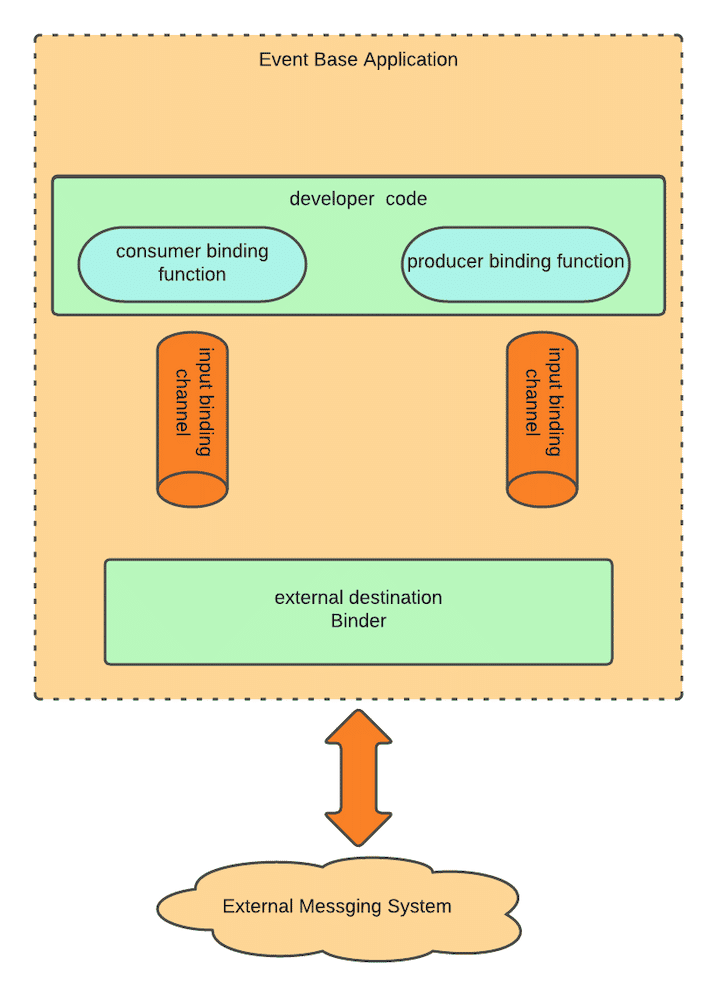

# Cargo Tracker 0.1<sup id="a1">[[1]](#f1)</sup> - Event Driven Architecture in Spring Cloud Stream

## About Spring Cloud Stream
The Spring Cloud Stream is a project under the Spring umbrella, which allows developers to build event-centric distributed applications.
This project shows the basic configuration and programming APIs in Spring Cloud Stream to integrate with an external messaging system
Apache Kafka. For a description of Spring Cloud Stream's full functionalities, refer to its 
[official reference documentation](https://docs.spring.io/spring-cloud-stream/docs/current/reference/html/spring-cloud-stream.html#_a_brief_history_of_springs_data_integration_journey).


## Apache Kafka Setup
This Spring Boot project uses Apache Kafka as a messaging platform.
To run this project, you need to set up Kafka first.

#### Linux and MacOS
Download a **binary package** of Apache Kafka (e.g., `kafka_2.13-3.7.0.tgz`) from
[https://kafka.apache.org/downloads](https://kafka.apache.org/downloads)
and upzip it.
In the Terminal, `cd` to the unzip folder, and start Kakfa with the following commands (each in a separate Terminal session):
```bash
./bin/zookeeper-server-start.sh ./config/zookeeper.properties
```
```bash
./bin/kafka-server-start.sh ./config/server.properties
```

#### Windows
Download a **binary package** of Apache Kafka (e.g., `kafka_2.13-3.7.0.tgz`) from
[https://kafka.apache.org/downloads](https://kafka.apache.org/downloads)
and unzip it to a directory, e.g., `C:\kafka`&mdash;Windows does not like a complex path name (!).

<!--
In the configuration file `C:\kafka\config\zookeeper.properties`, comment out the line `"dataDir=/tmp/zookeeper"`. In `C:\kafka\config\server.properties`, change the line `"log.dirs=/tmp/kafka-logs"` to `"log.dirs=.kafka-logs"`.
-->

Use the following two commands in the Windows CMD (one in each window) to start Kafka:
```bash
C:\kafka\bin\windows\zookeeper-server-start.bat C:\kafka\config\zookeeper.properties
```
```bash
C:\kafka\bin\windows\kafka-server-start.bat C:\kafka\config\server.properties
```

### Run the Application ##
Book and check cargoes with the following command:
(Linux/MacOS)
```shell
curl -X POST -H "Content-Type:application/json" -d '{"bookingAmount":20,"originLocation":"HK","destLocation":"NY","destArrivalDeadline":"2010-08-01"}' http://localhost:8787/cargobooking
```
```shell
curl -X GET -H "Content-Type:application/json" http://localhost:8787/cargobooking/findAllBookingIds
```
(windows)
```shell
curl -X POST -H "Content-Type:application/json" -d "{\"bookingAmount\":20,\"originLocation\":\"HK\",\"destLocation\":\"NY\",\"destArrivalDeadline\":\"2010-08-01\"}" http://localhost:8787/cargobooking
```
```shell
curl -X GET -H "Content-Type:application/json" http://localhost:8787/cargobooking/findAllBookingIds
```

### View Kafka Topics
After running the `bookingms`'s main class, check the Kafka topics with the following command:

(Linux/MacOS)
```shell
./bin/kafka-topics.sh --bootstrap-server=localhost:9092 --list
```
(Windows)
```shell
C:\kafka\bin\windows\kafka-topics.bat --bootstrap-server=localhost:9092 --list
```
You should see two topic names `cargobookings` and `cargoroutings`. You can read data in the `cargobookings` topic:

(Linux/MacOS)
```shell
./bin/kafka-console-consumer.sh --bootstrap-server localhost:9092 --topic cargobookings --from-beginning
```
(Windows)
```shell
c:\kafka\bin\windows\kafka-console-consumer.bat --bootstrap-server localhost:9092 --topic cargobookings --from-beginning
```

### Trouble Shooting
If you cannot start Kafka, try to clean up data in the Kafka topics to start over.
For this purpose, in Linux/MacOS, delete the folders `/tmp/zookeeper`, `/tmp/kafka-logs`
and `/tmp/kafka-streams` (if any). In Windows, delete the folders `C:\tmp\zookeeper`,
`C:\tmp\kafka-logs` and `C:\kafka\kafka-streams` (if any).


## Event-Driven Architecture

<!-- ### Origin of `CargoBookedEvent` and `CargoRoutedEvent`-->
### Events and Kafka Topics

Two Kafka topics, `"cargobookings"` and `"cargoroutings"` are created by this application (i.e., by the **Booking Microservice**).
Events [`CargoBookedEvent`](./bookingms/src/main/java/csci318/demo/cargotracker/shareddomain/events/CargoBookedEvent.java) and
[`CargoRoutedEvent`](./bookingms/src/main/java/csci318/demo/cargotracker/shareddomain/events/CargoRoutedEvent.java) are published to these
two topics, respectively. The source code of the two events is in the `sharedmain.events` package.

The two events are orignally created  by the domain class
[`Cargo`](./bookingms/src/main/java/csci318/demo/cargotracker/bookingms/domain/model/aggregates/Cargo.java), by using the `AbstractAggregateRoot` generic class
(see [REST Services with Spring V4](https://github.com/gxshub/rest-services-with-spring-v4)).
The two events are listened to by the
[`CargoEventPublisherService`](./bookingms/src/main/java/csci318/demo/cargotracker/bookingms/application/outboundservices/CargoEventPublisherService.java),
which publish the same events, but as external events, to the two Kafka topics.
But only the `"cargobookings"` topic is used in the demonstration.

### Binder in Spring Cloud Stream  ###



(Picture taken from: [https://gorillalogic.com/blog/an-introduction-to-spring-cloud-streams](https://gorillalogic.com/blog/an-introduction-to-spring-cloud-streams))

### The StreamBridge API and Binding Configuration
<!--- ### Kafka Publisher API in Booking Microservice -->

The following _two_ parts in the source code of **Booking Microservice** relate to publishing events to Kafka topics.

(1) A Kafka binder and two binding channels are defined in the file [`application.properties`](./bookingms/src/main/resources/application.properties)
of Booking Microservice:
```properties
spring.cloud.stream.kafka.binder.brokers=localhost:9092
spring.cloud.stream.bindings.cargoBookingChannel.destination=cargobookings
spring.cloud.stream.bindings.cargoRoutingChannel.destination=cargoroutings
```
The port `localhost:9092` runs the Kafka server. The two Kafka topics `"cargobookings"` and `"cargoroutings"`
are bound to two **binding channels** named `"gargoBookingChannel"` and `"cargoBoutingChannel"`.

<!---
(2) The two (output) binding message channels are used in the interface [`CargoEventSource`](./bookingms/src/main/java/csci318/demo/cargotracker/bookingms/infrastructure/brokers/CargoEventSource.java)
of Booking Microservice:
```java
public interface CargoEventSource {
    
    @Output("cargoBookingChannel")
    MessageChannel cargoBooking();

    @Output("cargoRoutingChannel")
    MessageChannel cargoRouting();
}
```
--->

(2) In [`CargoEventPublisherService`](./bookingms/src/main/java/csci318/demo/cargotracker/bookingms/application/internal/outboundservices/CargoEventPublisherService.java),
the `StreamBridge` API is used to send `CargoBookedEvent` and `CargoRoutingEvent` to the two topics.
```java
@Service
public class CargoEventPublisherService {

    private final StreamBridge streamBridge;

    public CargoEventPublisherService(StreamBridge streamBridge) {
        this.streamBridge = streamBridge;
    }

    @TransactionalEventListener
    public void handleCargoBookedEvent(CargoBookedEvent cargoBookedEvent) {
        streamBridge.send("cargoBookingChannel", cargoBookedEvent);
    }

    @TransactionalEventListener
    public void handleCargoRoutedEvent(CargoRoutedEvent cargoRoutedEvent) {
        streamBridge.send("cargoRoutingChannel", cargoRoutedEvent);
    }
}
```

__Note__ the correspondence of binding names `"cargoBookingChannel"` and  `"cargoBookingChannel"`
in `CargoEventPublisherService` and the above `application.properties` file.

### The Function API and Binding Configuration

The consumer end of events is somehow different.
The following _two_ parts in the source code of **Tracking Microservice** relate to event subscription to a Kafka topic.

(1) The Kafka binders are defined in the file [`application.properties`](./trackingms/src/main/resources/application.properties)
of Tracking Microservice:
```properties
spring.cloud.function.definition=consume
spring.cloud.stream.bindings.consume-in-0.destination=cargobookings
spring.cloud.stream.kafka.binder.brokers=localhost:9092
```
The Kafka topic name `cargobookings` is also declared in the Booking MS.
`consume` is the function name, which is used in the code (see below).
`consume-in-0` is the input argument (i.e. an event stream) for `consume` and 
is bound to `cargobookings`. 

(2) The [`CargoRoutedEventHandler`](./trackingms/src/main/java/csci318/demo/cargotracker/trackingms/interfaces/events/CargoRoutedEventHandler.java)
includes the following code. 
The `java.util.function.Consumer` API is used to consume events, where 
`consume()` corresponds to the function name in the above `application.properties` file.
```java
@Service
public class CargoRoutedEventHandler {

    private static final Logger log = LoggerFactory.getLogger(CargoRoutedEventHandler.class);

    @Bean
    public Consumer<CargoBookedEvent> consume() {
        return payload -> log.info(payload.toString());
    }
}
```

Additional reference: [https://gorillalogic.com/blog/an-introduction-to-spring-cloud-streams](https://gorillalogic.com/blog/an-introduction-to-spring-cloud-streams)

***TODO:*** Implement a producer in the **Booking Microservice** to produce events to the `"cargoroutings"` topic
and a consumer in the **Routing Microservice** to consume events from this topic.

## About CQRS in the Application Layer

The Command and Query Responsibility Segregation (CQRS) architectural pattern is used in
the application layer of BookingMS
(c.f., the corresponding packages in the
[code](./bookingms/src/main/java/csci318/demo/cargotracker/bookingms/application)).

Reference for CQRS: [https://learn.microsoft.com/en-us/azure/architecture/patterns/cqrs](https://learn.microsoft.com/en-us/azure/architecture/patterns/cqrs)

---
<a id="f1">[1]</a> Note. The project is based on the source code for
[Chapter 5](https://github.com/practicalddd/practicaldddbook/tree/master/Chapter5) of the book _Practical Domain-Driven Design in Enterprise Java_ with modification. The images are taken also from the book. [↩](#a1)


